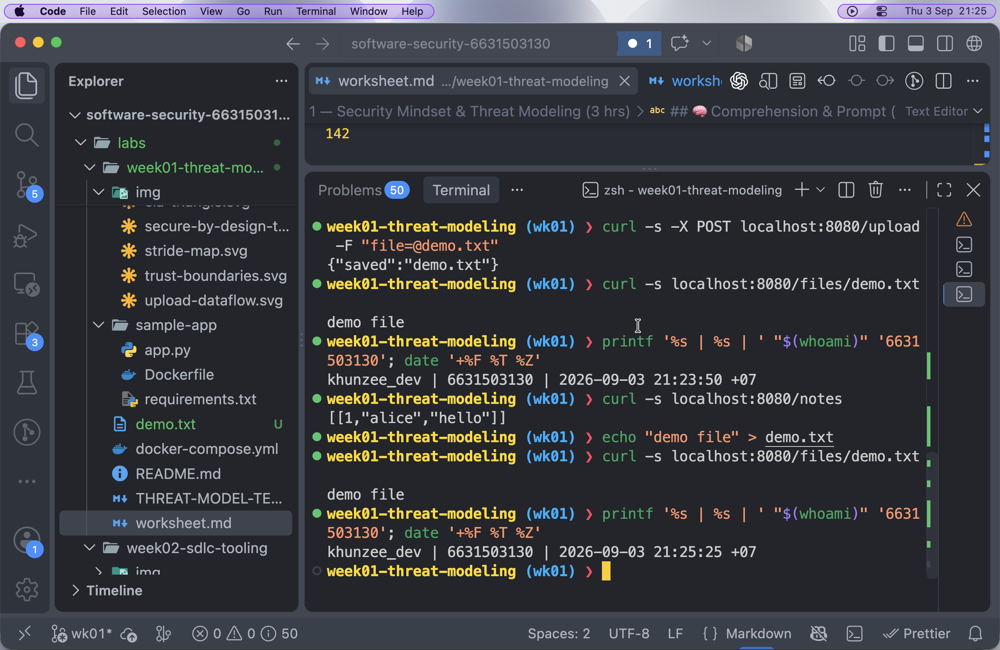
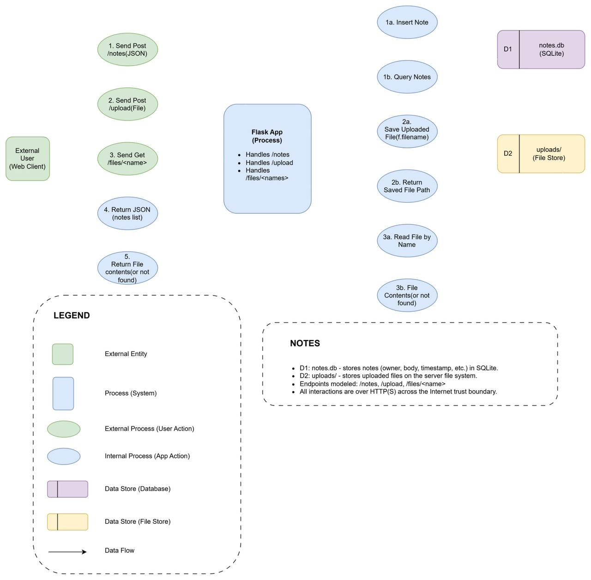
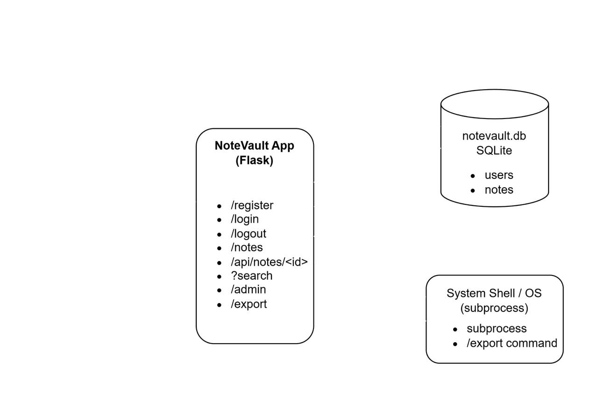

# Worksheet 1 — Security Mindset & Threat Modeling (3 hrs)

> **Course:** Software Security (KOSEN69) · **Week 1**
> **Aligned to:** OWASP 2025 A06 Insecure Design · CWE-501 (Trust Boundary Violation)
> **Signature game:** "Elevation of Privilege" (Microsoft STRIDE card deck)

> **Ethics note:** This week is _modeling only_ — you analyze design, you do **not** attack the app. Run the sample app only on your own VM/localhost. Never apply these techniques to systems you do not own or lack written permission to test.

## Part 1 — Student Information

| Name | Student ID | Date | Group |

| ZAW PHYO AUNG | 6631503130 | 2026-09-03 | |

## Part 2 — Lecture Questions

1. Define the CIA triad and give one concrete failure example for each of the three properties.

   The CIA triad stands for Confidentiality, Integrity, and Availability. Confidentiality fails if another user can see my private notes, integrity fails if someone can change my notes without permission, and availability fails if the server becomes overloaded and I cannot access the application.

2. What is a _trust boundary_, and why does data crossing one deserve extra scrutiny?

   A trust boundary is a point where data moves between parts of a system that have different levels of trust. For example, data coming from a web user into the Flask application crosses a trust boundary, so the application should check and validate it before trusting or using it.

3. Explain "attack surface." Name two things that increase it in a web app.

   The attack surface is all the places where someone can interact with or provide input to a system. In a web application, adding more API endpoints and allowing file uploads increase the attack surface because they create more ways for untrusted input to enter the system.

4. What does each STRIDE letter map to, and which security property does each threat violate?

   STRIDE stands for Spoofing, Tampering, Repudiation, Information Disclosure, Denial of Service, and Elevation of Privilege. Spoofing affects authentication, Tampering affects integrity, Repudiation affects accountability, Information Disclosure affects confidentiality, Denial of Service affects availability, and Elevation of Privilege affects authorization.

5. What does "Secure by Design" (CISA) mean, and how does it differ from bolting security on after release?

   Secure by Design means thinking about security while designing and building a system instead of waiting until problems appear later. It helps prevent security problems from being built into the system, while adding security after release usually means fixing vulnerabilities after they have already been created.

## Part 3 — Hands-on Lab (180 min)

**Learning goals:** build a data-flow diagram (DFD), apply STRIDE to a real Flask app, rank risks, and propose mitigations.
**Prerequisites:** Docker + Docker Compose in your VM; a drawing tool (draw.io / paper + photo); the Elevation of Privilege deck (print or virtual) — free print-and-play PDF at [github.com/adamshostack/eop](https://github.com/adamshostack/eop).

**Environment setup**

```bash
cd labs/week01-threat-modeling
docker compose up --build           # starts sample-app on http://localhost:8080
curl -s -X POST localhost:8080/notes -H 'Content-Type: application/json' \
     -d '{"owner":"alice","body":"hello"}'   # observe behavior, do not attack
curl -s localhost:8080/notes

echo "demo file" > demo.txt
curl -s -X POST localhost:8080/upload -F "file=@demo.txt"   # observe behavior, do not attack
curl -s localhost:8080/files/demo.txt
```

Source to model lives in `sample-app/app.py`. Template to fill: `THREAT-MODEL-TEMPLATE.md` (copy it, do not edit the original).

**What to submit per task:** the threat/element identified + a screenshot (DFD, table, or running app) + a 2–3 sentence mitigation.

### Task 0 — Onboarding

I started the sample Flask application using Docker Compose and verified that the environment was working correctly. I successfully created and retrieved a note through `/notes`, uploaded `demo.txt` through `/upload`, and retrieved the file through `/files/demo.txt`. The screenshot also shows my username, student ID, date, and time as required for identity proof.



**Task 1 — Draw the DFD (25 min)** · _Goal:_ map the system. _Steps:_ identify the external entity (web client), the process (Flask app), the data store (`notes.db` SQLite), the `uploads/` store, and the flows for `/notes`, `/upload`, `/files/<name>`; mark the Internet→app trust boundary with a dashed line. _Deliverable:_ DFD image embedded in your copy of the template.

The DFD shows the Web Client as the external entity and the Flask App as the main process. The client communicates with the Flask App through `/notes`, `/upload`, and `/files/<name>`, while the Flask App reads and writes data to `notes.db` and the `uploads/` file store. The dashed line represents the trust boundary between the untrusted Internet/client side and the Flask application.



**Task 2 — STRIDE the elements (30 min)** · _Goal:_ enumerate threats per element. _Steps:_ for each element fill the S/T/R/I/D/E grid. Ground it in real code: `/notes` accepts a client-supplied `owner` with no auth (Spoofing); `/upload` saves raw `f.filename` — arbitrary-file-write (Tampering) — and echoes the resolved save path back in its response (Information disclosure); `/files/<name>` reads it back but is comparatively defended (see Task 5); no logging anywhere (Repudiation). _Deliverable:_ completed STRIDE table.

**Answer:**

| Element / Flow  | S - Spoofing                                                   | T - Tampering                                        | R - Repudiation                                    | I - Information Disclosure                           | D - Denial of Service                            | E - Elevation of Privilege                                 |
| --------------- | -------------------------------------------------------------- | ---------------------------------------------------- | -------------------------------------------------- | ---------------------------------------------------- | ------------------------------------------------ | ---------------------------------------------------------- |
| `/notes`        | User can claim any `owner` because there is no authentication. | User can submit untrusted note data.                 | Note actions are not logged.                       | Notes may be exposed without proper access control.  | Many requests could consume server resources.    | No clear threat identified.                                |
| `/upload`       | No clear threat identified.                                    | Raw `f.filename` is used when saving the file.       | Upload actions are not logged.                     | The response reveals the server save path.           | Large or repeated uploads could consume storage. | No clear threat identified.                                |
| `/files/<name>` | No clear threat identified.                                    | Comparatively protected against unsafe path access.  | File access is not logged.                         | Files could be exposed without proper authorization. | Many requests could consume resources.           | No clear threat identified.                                |
| Flask App       | No clear threat identified.                                    | Untrusted input can affect application operations.   | There is no audit logging.                         | Server information may be exposed.                   | Excessive requests may affect availability.      | Missing authorization could allow unauthorized operations. |
| `notes.db`      | No clear threat identified.                                    | False or unauthorized note data could be stored.     | Changes cannot be linked to an authenticated user. | Stored notes could be exposed.                       | Resource exhaustion could affect availability.   | No clear threat identified.                                |
| `uploads/`      | No clear threat identified.                                    | Client-controlled filenames can affect stored files. | File changes are not logged.                       | Uploaded files could be exposed.                     | Too many files could fill storage.               | No clear threat identified.                                |

## Task 3 — Elevation of Privilege Game

### Goal

Find threats that the STRIDE grid alone missed. The EoP deck helps you think beyond per-element threats to system-level risks and attack chains.

### Steps

1. **Prepare the deck:** Print the EoP deck from [github.com/adamshostack/eop](https://github.com/adamshostack/eop), or use the digital simulator below (click "Draw" to pull cards one at a time).
2. **Draw a card:** Read the threat or attack scenario on it.
3. **Map to your DFD:** Ask: _Does this card describe something possible against my system?_
   - **Yes:** Note the card name, which DFD element(s) it affects, and score 1 point.
   - **No:** Set it aside, move to the next card.
4. **Record valid threats:** Build a list of all cards that map to real threats in your design.
5. **Tally your score:** Count the cards you successfully mapped.

### Scoring Rules

- **Valid mapping:** The card describes a real attack surface or weakness in your system. Examples:
  - Card: "Attacker modifies data in storage" → Your `notes.db` has no access controls. **Valid: 1 point.**
  - Card: "Attacker intercepts client-server communication" → Your app uses HTTP (no HTTPS). **Valid: 1 point.**
  - Card: "Attacker escalates privileges via firmware" → Your app is a web service, not an OS. **Invalid: 0 points.**
- **Each card scores at most once,** even if it maps to multiple elements.

### Expected Output

Example of a completed "carded threats" list:

```
Card: "Attacker Modifies Data in Storage"
  → Maps to: notes.db (Tampering threat)
  → Real risk: No access control or validation; anyone can modify any note

Card: "Attacker Intercepts Data in Transit"
  → Maps to: `/upload` and `/files/<name>` flows (Information Disclosure)
  → Real risk: File paths and contents sent over cleartext HTTP

Card: "Attacker Uses Application via Unexpected Input"
  → Maps to: `/upload` endpoint (Tampering threat)
  → Real risk: Raw f.filename saved without sanitization; path traversal possible

Card: "Attacker Replays Old Transactions"
  → Maps to: No clear threat (would need session state)
  → Real risk: Not applicable; app is stateless

Total score: 3/78 cards mapped to valid threats
```

### Digital Deck Simulator

```sim
eop-deck
```

_Deliverable:_ your carded threats list (at least the mapped cards, not necessarily all 78) + your final score + a note on which threats surprised you or were new compared to Task 2 STRIDE grid.

**Task 3b — Systems-level pass (25 min) 🔭**

### Goal

Find threats that appear only when the complete system, its trust boundaries, and its attack chains are considered together. Tasks 2 and 3 examine elements and cards; this pass asks what an attacker can reach across the whole diagram ([Joshi et al., ASEE 2024](https://arxiv.org/abs/2404.16632)).


### Steps

1. **Trace a request end-to-end:** Follow `POST /notes` from the Web Client to the Flask App, into `notes.db`, and back to the client. List each trust boundary crossed and identify where authentication, authorization, or validation is missing.
2. **Assume the Flask process is owned:** Record what the attacker can now reach, such as notes, uploaded files, application responses, and other files permitted by the process's filesystem access.
3. **Assume the `uploads/` store is owned:** Record what the attacker can change, delete, or add, and explain what a later `/files/<name>` request would return to a user.
4. **Build one threat chain:** Combine two findings that seemed minor on their own. Write the chain as `A → B → consequence`.
5. **Write a system claim:** Finish the sentence, "Even if every element-level mitigation in Task 8 is implemented, this system still fails if \_\_\_."

Use the simulation below before writing your answer. Toggle a component to attacker-controlled and observe which other components become reachable:

```sim
trust-boundary
```

### Expected Output

For a `POST /notes` request, the flow is:

`Web Client → Flask App → notes.db → Flask App → Web Client`

The request crosses the untrusted-client-to-application boundary and a logical application-to-data-store boundary. The client-to-application boundary has no authentication or authorization check, and the database has no independent access control. If the Flask process is owned, the attacker can read or modify both `notes.db` and `uploads/`, control responses, and expose stored data. If `uploads/` is owned, the attacker can replace files that the application later serves, but the current application does not execute uploaded files.

One possible chain is:

`No authentication on /notes → attacker submits a note using another owner's name → false content is stored under that identity`

One possible system claim is: "Even if every element-level mitigation in Task 8 is implemented, this system still fails if the application runs with excessive filesystem permissions or if authorization is not enforced consistently at every endpoint."

_Deliverable:_ the end-to-end boundary list, one reachability note for the owned Flask process, one reachability note for the owned `uploads/` store, one threat chain, and the completed system claim.

**Task 4 — Abuse cases & attacker personas (20 min)**

### Goal

Describe realistic attackers, their capabilities, and the actions they may take against the sample application. Each abuse case must name the attacker's goal, the action taken, the DFD elements involved, and the resulting impact.

### Steps

1. **Define two personas:** Use a curious authenticated user who should access only their own data and an anonymous Internet attacker who can send requests without an account.
2. **Write two abuse cases per persona:** Describe the attacker action as a short scenario beginning with "The attacker...".
3. **Map each case:** Name the endpoint and DFD elements involved, then classify the case with one or more STRIDE categories.
4. **State the impact:** Explain what confidentiality, integrity, availability, or accountability property is affected.

### Expected Output

**Persona 1: Curious authenticated user**

- **Abuse case 1 — Impersonate another owner:** The user submits `POST /notes` with another person's name in `owner`. Because the application does not authenticate the requester or verify ownership, the note is stored under that person's identity. Elements: Web Client, `/notes`, Flask App, and `notes.db`. STRIDE: Spoofing and Tampering.
- **Abuse case 2 — Read other users' notes:** The user sends `GET /notes` and receives the complete notes table instead of only their own notes. Elements: `/notes`, Flask App, and `notes.db`. STRIDE: Information Disclosure and Elevation of Privilege.

**Persona 2: Anonymous Internet attacker**

- **Abuse case 3 — Choose a dangerous upload path:** The attacker submits a file with client-controlled path components in its filename. The application joins that filename to `uploads/` without sanitizing it. Elements: Web Client, `/upload`, Flask App, and the filesystem. STRIDE: Tampering.
- **Abuse case 4 — Download another user's upload:** The attacker requests `/files/<name>` for a file uploaded by someone else. The endpoint has no authentication or ownership check. Elements: `/files/<name>`, Flask App, and `uploads/`. STRIDE: Information Disclosure.

_Deliverable:_ two named attacker personas and four abuse cases, each mapped to DFD elements, a STRIDE category, and an impact.

**Task 5 — Path-traversal deep-dive (25 min)**

### Goal

Trace the upload flow and explain why a client-controlled filename must never be used directly as a filesystem path.

### Steps

1. **Trace the write:** Start at the multipart request to `/upload` and follow `f.filename` into `f.save(os.path.join(UPLOAD_DIR, f.filename))`.
2. **Identify the trust-boundary failure:** Explain why `f.filename` is untrusted and how parent-directory components such as `../` can change the final path.
3. **Trace the read:** Follow a later request to `/files/<name>` and explain what file the application attempts to return.
4. **Design the fix:** Describe filename normalization with `secure_filename`, a server-generated storage name, an extension allow-list, a private upload directory, file-size limits, and authorization on retrieval.
5. **Separate protections:** Explain why `send_from_directory` may constrain the read endpoint but does not repair the unsafe write in `/upload`.

### Expected Output

The flow is:

`Web Client --multipart file--> /upload → Flask App → os.path.join("uploads", f.filename) → filesystem`

The filename comes from the client. If it contains parent-directory components, joining it with `uploads/` can produce a path outside the intended directory. The root cause is that an untrusted string controls a filesystem path. The later flow is `Web Client → /files/<name> → Flask App → uploads/`; `send_from_directory` can constrain file reads, but it does not undo a dangerous write that already happened during upload.

A secure design should normalize and validate the original name, reject empty or disallowed names, generate a random server-side name, store the file outside the application source tree and web root, limit its size, use restrictive permissions, and enforce authorization before serving it. For example:

```python
from secrets import token_hex
from werkzeug.utils import secure_filename

original_name = secure_filename(f.filename or "")
if not original_name:
  return {"error": "invalid filename"}, 400

extension = original_name.rsplit(".", 1)[-1].lower()
if extension not in {"txt", "pdf", "png", "jpg"}:
  return {"error": "file type not allowed"}, 400

stored_name = f"{token_hex(16)}.{extension}"
destination = os.path.join(PRIVATE_UPLOAD_DIR, stored_name)
f.save(destination)
```

The server-generated name prevents the client from selecting path components. Authentication and authorization are still required so that one user cannot retrieve another user's upload.

_Deliverable:_ the `/upload` and `/files/<name>` data-flow trace, an explanation of the root cause, a secure-design note, and a short explanation of why the proposed controls address the vulnerability class rather than only one filename.

**Answer:**



**Top 3 STRIDE threats to investigate**

1. **Elevation of Privilege — `/register`:** The registration endpoint accepts the `role` value from the client. I would investigate whether a normal user could obtain privileges that should only be assigned by the server.

2. **Information Disclosure / Elevation of Privilege — `/api/notes/<nid>`:** The endpoint checks that the requester is logged in, but it does not check whether the requested note belongs to that user. I would investigate whether this could expose another user's notes.

3. **Tampering — `/search`:** The search endpoint builds an SQL query using user-controlled input instead of a parameterized query. I would investigate whether specially formed search input could change the intended database query.

**Task 7 — Security requirements (15 min)**

### Goal

Turn the threats from Task 2 or Task 6 into security requirements that can be tested by another person. A good requirement describes the security control, the condition under which it applies, and the risk it reduces.

### Steps

1. **Choose three threats:** Select findings from the sample app or NoteVault. Include at least one threat involving authentication or authorization and at least one involving input validation or data protection.
2. **Write acceptance criteria:** Use the form, "The system must **[control]** when **[condition]** so that **[security outcome]**."
3. **Make each requirement testable:** State what request, role, input, or expected response would prove that the requirement passes or fails. Avoid vague words such as "securely" or "properly" without observable behavior.
4. **Map each requirement:** Identify the source threat, affected endpoint or DFD element, and the STRIDE category.

### Expected Output

| ID   | Testable security requirement                                                                                                                                                                       | Source threat / element                                              | Verification condition                                                                                                                    |
| ---- | --------------------------------------------------------------------------------------------------------------------------------------------------------------------------------------------------- | -------------------------------------------------------------------- | ----------------------------------------------------------------------------------------------------------------------------------------- |
| SR-1 | The system must derive the note owner from the authenticated session and ignore any client-supplied owner value so that a user cannot create a note under another user's identity.                  | Spoofing / Tampering — `/notes`                                      | Submit a note while authenticated as Alice with `owner` set to Bob; the stored note owner remains Alice.                                  |
| SR-2 | The system must allow a user to retrieve a note only when that note belongs to the authenticated user so that private notes are not disclosed across accounts.                                      | Information Disclosure / Elevation of Privilege — `/api/notes/<nid>` | Request another user's note while authenticated; the response is denied and does not contain the note body.                               |
| SR-3 | The system must reject filenames that are not in the approved extension allow-list and must store accepted uploads under server-generated names so that user input cannot select a filesystem path. | Tampering — `/upload`                                                | Submit a disallowed extension or path-like filename; the request is rejected or stored under a generated name outside the requested path. |

Replace the examples with your own wording if you selected different threats. The verification condition must still be specific enough for a classmate to execute without guessing.

_Deliverable:_ three acceptance-criteria security requirements, each mapped to a Task 2 or Task 6 threat, endpoint or DFD element, STRIDE category, and verification condition.

**Task 8 — Defend / fix it: rank & mitigate (25 min) 🛡️**

### Goal

Prioritize the most important threats and demonstrate that one mitigation changes observable behavior. A strong defense connects likelihood and impact to a concrete control, then verifies the control with before-and-after evidence.

### Steps

1. **List candidate threats:** Use the findings from Tasks 2–7. Include threats affecting confidentiality, integrity, availability, authentication, authorization, or accountability.
2. **Score likelihood and impact:** Use a 1–5 scale for each. Calculate `risk score = likelihood × impact`, explain the scores briefly, and rank the five highest results.
3. **Propose one mitigation per threat:** Name the control, where it belongs, and the behavior it should change. Examples include authentication and ownership checks for `/notes`, parameterized queries for `/search`, `secure_filename` plus server-generated names for `/upload`, audit logging, and request size or rate limits.
4. **Choose one fix to implement:** Select a mitigation that can be demonstrated locally. Keep the vulnerable lab behavior available for the before comparison, and make the smallest change needed in your fork.
5. **Capture before-and-after evidence:** Record the exact request and output that demonstrate the vulnerability before the fix. Run the same request after the fix and record the refusal or safe result. Add the required identity stamp to the evidence image.
6. **Assess the security boundary:** Explain whether the change fixes one instance or prevents the broader vulnerability class. Identify one remaining way the class could reappear if your control is applied inconsistently.

### Expected Output

Use a table such as this for the ranking:

| Rank | Threat and affected element                                     | Likelihood (1–5) | Impact (1–5) | Risk score | Mitigation and verification                                                                                           |
| ---- | --------------------------------------------------------------- | ---------------: | -----------: | ---------: | --------------------------------------------------------------------------------------------------------------------- |
| 1    | Unauthorized access to another user's note — `/api/notes/<nid>` |                4 |            5 |         20 | Check authenticated ownership before returning a note; verify a cross-user request is denied.                         |
| 2    | Client-controlled upload path — `/upload`                       |                4 |            5 |         20 | Generate the storage name server-side and validate the file type; verify path-like names cannot select a destination. |
| 3    | Privilege assignment from client input — `/register`            |                3 |            5 |         15 | Ignore client-supplied roles and assign roles server-side; verify registration cannot create an administrator.        |
| 4    | SQL injection in search — `/search`                             |                3 |            5 |         15 | Use parameterized queries; verify special input is treated as data and does not alter query results.                  |
| 5    | Unauthenticated note listing — `/notes`                         |                4 |            4 |         16 | Require authentication and filter results by the session owner; verify anonymous or cross-user requests are denied.   |

For the mitigation you implement, submit:

1. **Diff:** the relevant diff and the commit hash from your `wk01` branch.
2. **Before evidence:** the exact request and output showing the original behavior.
3. **After evidence:** the same request and output showing refusal or safe handling.
4. **Class-level explanation:** in 2–3 sentences, explain why the control addresses the vulnerability class. For example, `secure_filename()` on one endpoint is an instance fix; a design rule that no user-supplied string becomes a path component is a class-level control. State which one your implementation provides and what broader control would still be needed.

### Evidence checklist

- The same request is used before and after the change.
- The response status and relevant body are visible.
- The screenshot includes the terminal identity stamp required by this worksheet.
- The evidence was produced on your local VM or localhost, not copied from another student.

_Deliverable:_ the ranked top-five threat table, one implemented mitigation, its diff and commit hash, before-and-after evidence, and the class-level explanation.

_Deliverable — the top-5 table, plus for the one you implemented:_

1. the **diff** (commit hash on your `wk01` branch),
2. **evidence it works**: the request that succeeded before your change and is refused after — both outputs,
3. **why it closes the class, not the instance** (2–3 sentences). `secure_filename()` on one endpoint is an instance fix; _"no user-supplied string ever becomes a path component"_ is a class fix. Say which yours is, and if it's an instance fix, say what the class fix would be.

> **Why this is weighted.** Fewer than half of working developers can spot a security hole in code, and being shown vulnerabilities does not by itself teach you to find or close them. Exploiting is the half that feels like progress; defending is the half that transfers to your job.

## Part 4 — Reflection

1. Map your top finding to a CWE and to OWASP A06 (Insecure Design); explain the mapping in one sentence.
2. Name one real-world breach caused by a design flaw (not a missing patch) and what design control would have prevented it.
3. Of your five mitigations, which gives the most risk reduction per unit of effort, and why?

## Grading rubric (100)

| Criterion                                                                 | Points |
| ------------------------------------------------------------------------- | ------ |
| Lecture questions (Part 2)                                                | 20     |
| Exploitation + evidence (DFD + STRIDE table + EoP findings + screenshots) | 40     |
| Defense (top-5 ranking + mitigations)                                     | 25     |
| Reflection (CWE/OWASP mapping + breach + best mitigation)                 | 15     |

**Assessed within the rows above** (they are not extra points — they are what those points are for):

- **Systems-level reasoning** (inside _Exploitation + evidence_, Task 3b): does the model reach past single elements to boundaries, reachability and chains? Scored with the STRIDE + systems-thinking rubrics of [Joshi et al. 2024](https://arxiv.org/abs/2404.16632).
- **Defensive proof** (inside _Defense_, Task 8): a claimed mitigation with no before/after evidence scores at most half. A mitigation you can show closing a _class_ scores full.
- **Adversarial thinking** (across the whole sheet): do the abuse cases, personas and chains show you reasoning as an attacker with goals and constraints — or just listing categories? This is the course's central disposition and it is assessed, not assumed.

---

## Evidence & Integrity (required)

- **Identity proof:** every screenshot/diagram must show a terminal running `printf '%s | %s | ' "$(whoami)" '<YOUR-STUDENT-ID>'; date '+%F %T %Z'` **in the
  same image as the evidence**. When the evidence is a browser page, a DevTools panel or a
  rendered response, put that terminal **beside the browser and capture the whole screen** — a
  cropped window carries nothing that identifies you, and the lab's own output is
  byte-identical for the whole cohort _by design_, so the stamp is the only thing that makes
  the shot yours. Generic or borrowed evidence is not accepted.
- **Personalized flag (if this lab issues one):** **\*\*\*\***\_\_\_\_**\*\*\*\***
  _Flags are unique per student — submitting another student's flag is a violation. How to submit: **learn.zcr.ai/submit** (full guide: `SUBMISSION.md` in the repo root)._
- **Explain in your own words** _(graded on your reasoning, not copied text):_
  1. What did you do, and **why did the vulnerability work**?
  I reviewed the /upload endpoint and found that the application used the filename provided by the client when saving the uploaded file. This is unsafe because the filename comes from untrusted user input, so a specially crafted filename could affect the path used by the server instead of being treated only as a normal filename.
  2. **Why does your fix actually stop it** — and what could still break it?
  My fix prevents the original client filename from being used directly as the filesystem path. The application validates the file extension, creates a new filename on the server, and saves the file only inside a fixed upload directory. However, other protections such as file-size limits, file-content validation, authentication, and storage limits would still be needed for a more complete upload security design.

---

## 🤖 Audit the AI (required)

### 1. AI Answer

I asked an AI assistant:

> How can I fix the unsafe filename handling in this Flask `/upload` endpoint?

The AI answered:

> You can use Flask/Werkzeug's `secure_filename()` function to make uploaded filenames safe before saving them.
>
> ```python
> from werkzeug.utils import secure_filename
> import os
>
> @app.route("/upload", methods=["POST"])
> def upload():
>     file = request.files["file"]
>     filename = secure_filename(file.filename)
>     file.save(os.path.join("uploads", filename))
>     return {"saved": filename}
> ```
>
> `secure_filename()` removes dangerous characters and path components from the filename, so this prevents path traversal and makes the upload secure.

### 2. What is wrong or risky?

The risky part of the AI answer is:

> "`secure_filename()` ... makes the upload secure."

This is incomplete. `secure_filename()` helps prevent unsafe filename/path handling, but it does not secure the whole upload feature. The code still uses a filename influenced by the client and does not check allowed file types, file size, duplicate filenames, or file contents.

### 3. Correct Version

A stronger solution is to validate the file extension and generate the actual stored filename on the server.

```python
import os
from uuid import uuid4
from flask import jsonify

UPLOAD_DIR = "uploads"
ALLOWED_EXTENSIONS = {"txt", "png", "jpg", "jpeg", "pdf"}

def allowed_file(filename):
    return (
        "." in filename
        and filename.rsplit(".", 1)[1].lower() in ALLOWED_EXTENSIONS
    )

@app.route("/upload", methods=["POST"])
def upload():
    f = request.files.get("file")

    if not f or not f.filename:
        return jsonify(error="file required"), 400

    if not allowed_file(f.filename):
        return jsonify(error="file type not allowed"), 400

    extension = f.filename.rsplit(".", 1)[1].lower()
    stored_name = f"{uuid4().hex}.{extension}"

    os.makedirs(UPLOAD_DIR, exist_ok=True)
    f.save(os.path.join(UPLOAD_DIR, stored_name))

    return jsonify(saved=stored_name), 201
```

The original AI answer was insufficient because it treated filename sanitization as complete upload security. My improved version validates the allowed extension and generates the stored filename on the server, so the original client filename is not used as a filesystem path component.

## 🧠 Comprehension & Prompt (required)

## 🧠 Comprehension & Prompt (required)

### A. Explain in Plain English (EiPE)

The `/upload` endpoint takes a file from the user and saves it on the server using a filename provided by the user. This is exploitable because the application trusts that filename when creating the save path, so specially crafted input could influence where the server writes the file.

### B. Prompt Problem

**Final Prompt:**

> Fix the Flask `/upload` endpoint so that it does not use the client-provided filename directly as a filesystem path. Save files only inside the fixed `uploads` directory, allow only `txt`, `png`, `jpg`, `jpeg`, and `pdf` extensions, and generate a new server-side filename using UUID. Return HTTP 400 for missing or disallowed files, do not expose the absolute server path, and do not change unrelated endpoints. Explain why the fix prevents unsafe filename/path handling.

**Verified Result:**

After applying the fix, I tested the `/upload` endpoint again. A valid file with an allowed extension was successfully uploaded, while a file with a disallowed extension was rejected with HTTP 400. The application also generated a new server-side filename instead of directly using the filename provided by the client.
