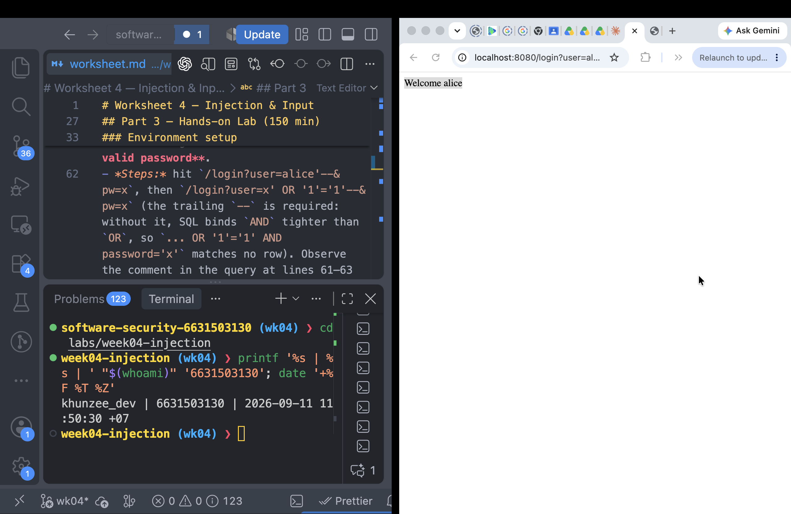
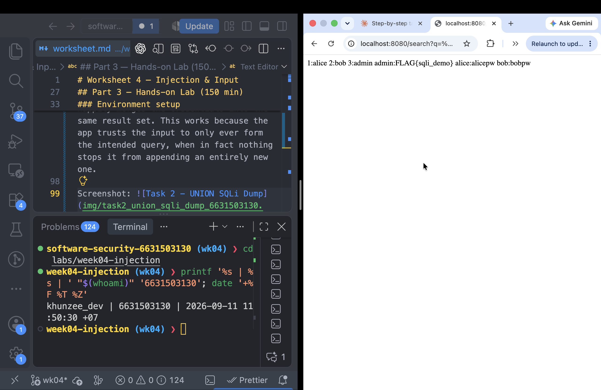
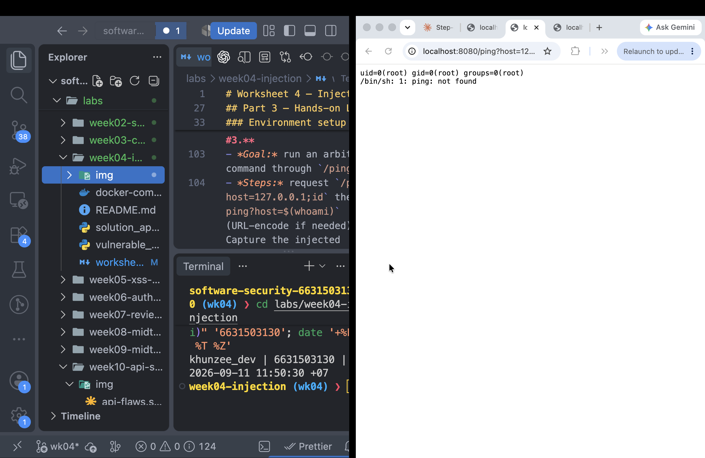
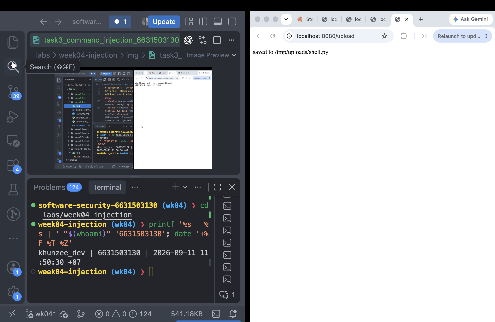
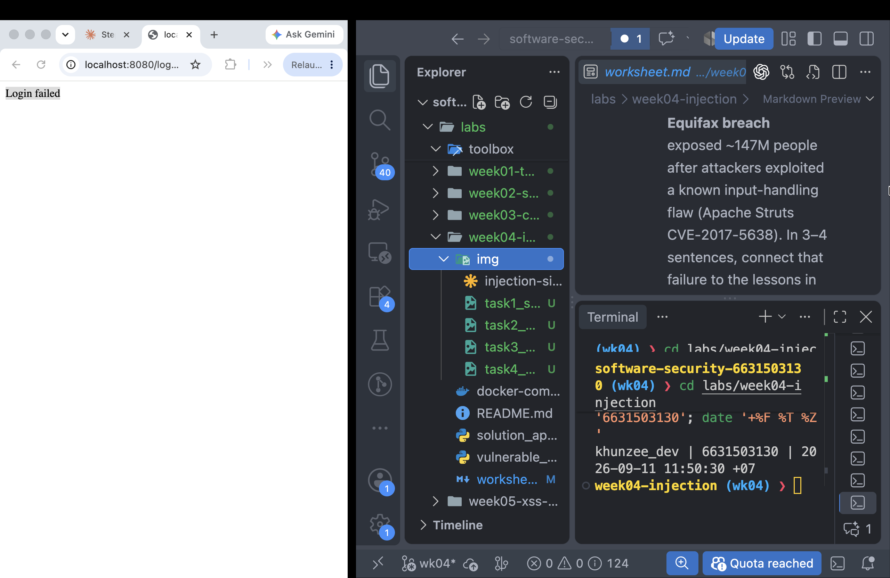
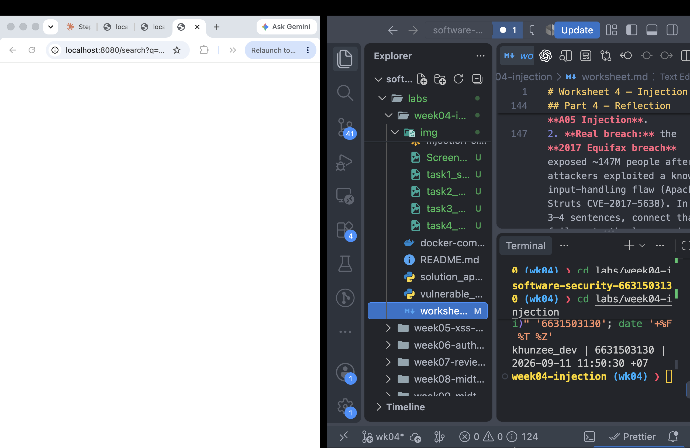
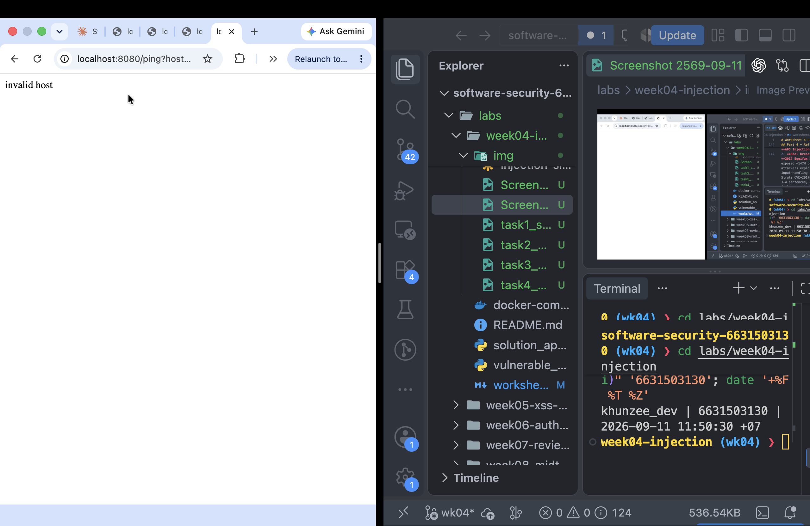
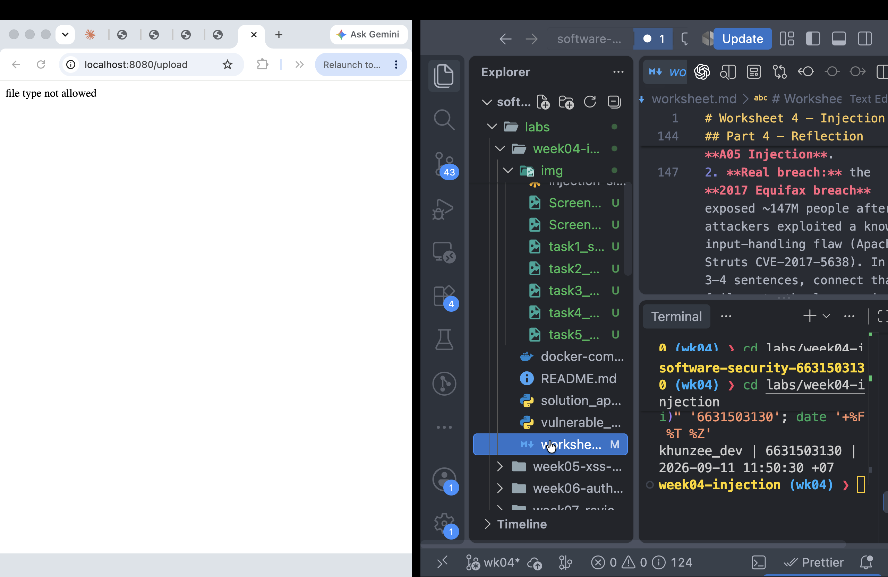

# Worksheet 4 — Injection & Input Handling (3 hrs)

> **Course:** Software Security (KOSEN69) · **Week 4**
> **Aligned:** OWASP 2025 **A05 Injection** · **CWE-89** (SQLi), **CWE-78** (OS command injection), **CWE-434** (unrestricted upload)
> **Signature game:** 🐉 **SQLi Boss Fight** — each successful injection lands a "hit" on the boss; the boss falls when you dump every credential and land an RCE.

> ⚠️ **Ethics note:** All payloads here are for the provided sandbox (`vulnerable_app.py`) and your own DVWA/Juice Shop containers **only**. Never test systems you do not own or have written permission to test. Unauthorized injection is a crime under most computer-misuse laws.

## Part 1 — Student Information

| Name          | Student ID | Date       | Group |
| ------------- | ---------- | ---------- | ----- |
| ZAW PHYO AUNG | 6631503130 | 2026-09-11 | ----- |

## Part 2 — Lecture Questions

Answer in 2–4 sentences each.

1. Why does a **parameterized query** (`execute(sql, (params,))`) defeat SQL injection, while string formatting (`"... '%s'" % user`) does not? Reference how the database treats data vs. code.
   A parameterized query sends the SQL structure and the user value separately, so the database treats the value only as data. String formatting inserts the value into the SQL text before execution, allowing quotes, comments, and operators to change the query's meaning.
2. In the `/ping` endpoint, `subprocess.run("ping -c 1 " + host, shell=True)` is vulnerable. Explain how `shell=True` turns user input into **CWE-78**, and how an argument array (`["ping","-c","1",host]`) removes the shell.
   With `shell=True`, the complete command string is interpreted by a shell, so characters such as `;`, `&&`, and `|` can start or combine additional commands. Passing an argument array with `shell=False` invokes the program directly and treats `host` as one argument instead of shell syntax.
3. Distinguish **input validation** (allow-list) from **output handling**. Why is validation alone insufficient defense for SQLi?
   Input validation restricts values to an expected format, while output handling safely encodes or escapes data for the context where it is displayed. Validation alone is insufficient for SQL injection because a value can pass a weak or incomplete check and still contain SQL syntax; parameterized queries must enforce the separation between SQL code and data.
4. The `/upload` route saves any filename to disk (**CWE-434**). What two properties must a directory and a filename have for an upload to become remote code execution, and which does `solution_app.py` remove?
   The uploaded file must be stored in a web-accessible or executable directory, and its filename or content must be accepted as a server-executable type such as `.py`. `solution_app.py` removes the dangerous type by applying an extension allow-list and uses `secure_filename` to reduce path traversal risk; uploads should also remain outside the executable web root.
5. What is a **UNION-based** SQLi, and why must the injected `SELECT` return the same number of columns as the original query? Relate to `/search?q=' UNION SELECT username,password FROM users--`.
   A UNION-based SQL injection appends the results of an attacker-controlled SELECT statement to the original query. The injected SELECT must return the same number of compatible columns because the database combines both results into one result set. In this lab, `username,password` matches the original two-column search result and exposes rows from the users table.


## Part 3 — Hands-on Lab (150 min)

**Learning goals:** extract data via SQLi, achieve OS command injection, exploit an unrestricted upload, then prove each fix in `solution_app.py` blocks the payload.

**Prerequisites:** Docker + Docker Compose, `curl`, a browser. Working dir: `labs/week04-injection/`.

### Environment setup

```bash
cd labs/week04-injection
docker compose up            # builds python:3.12-slim, installs flask, runs vulnerable_app.py
# vulnerable app -> http://localhost:8080   (service name: injection-lab, port 8080)
```

Optional secondary targets:

```bash
docker run --rm -it -p 80:80 vulnerables/web-dvwa        # DVWA  -> http://localhost
docker run --rm -p 3000:3000 bkimminich/juice-shop       # Juice Shop -> http://localhost:3000
```

**What to submit per task:** the exact **payload/command**, a **screenshot** of the response proving success, and a **2–3 sentence mitigation** in your own words.

---

**Task 0 — Onboarding**

I browsed to `http://localhost:8080/login?user=alice&pw=alicepw` and confirmed the page displayed "Welcome alice". The seeded users in the app are `alice` and `bob`.

evidence: [img/]

**Why concatenation is the flaw:**
The login endpoint builds its SQL query by directly inserting my input into the query string, instead of treating it as pure data. This means any special SQL characters I type (like a quote `'` or two dashes `--`) aren't just text — the database reads them as part of the query's actual syntax. A parameterized query would send my input as a separate, fixed value the database can never reinterpret as code, no matter what characters I type. With concatenation, the boundary between "data" and "code" disappears; with parameterization, that boundary is enforced structurally.

Task 1 — Auth bypass via SQLi

Payload URLs used:

1. http://localhost:8080/login?user=alice'--&pw=x
2. http://localhost:8080/login?user=x' OR '1'='1'--&pw=x

Both returned "Welcome alice" without providing a valid password.

Why it works:
The login endpoint builds its SQL query by pasting my input directly into the query string, roughly:
SELECT \* FROM users WHERE username='<input>' AND password='<input>'

When I send x' OR '1'='1'--, the query becomes:
SELECT \* FROM users WHERE username='x' OR '1'='1'--' AND password='x'

'1'='1' is always true, so the OR makes the entire WHERE clause evaluate to true regardless of username. The -- starts a SQL comment, so everything after it, including the password check, is ignored by the database entirely.

This shows that because the input is concatenated directly into the query, it can inject new SQL logic instead of being treated as plain data.

Screenshot: 

Task 2 — Credential dump via UNION SQLi

Payload URL used:
http://localhost:8080/search?q=' UNION SELECT username,password FROM users--

Result — dumped all rows from the users table:
1: alice
2: bob
3: admin
admin:FLAG{sqli_demo}
alice:alicepw
bob:bobpw

Why it works:
The /search endpoint likely runs a query like:
SELECT id, username FROM products WHERE title LIKE '%<input>%'

A UNION SELECT lets an attacker append a second, unrelated query that returns data from a completely different table, as long as the number of columns matches the original query exactly. Here, UNION SELECT username, password FROM users returns two columns matching the original query's shape, so the database happily merges the credentials into the same result set. This works because the app trusts the input to only ever form the intended query, when in fact nothing stops it from appending an entirely new one.

Screenshot: 

Task 3 — OS Command Injection

Payload used:
http://localhost:8080/ping?host=127.0.0.1;id

Result:
uid=0(root) gid=0(root) groups=0(root)
/bin/sh: 1: ping: not found

The id command executed successfully, proving arbitrary command execution. The "ping: not found" error is unrelated — it just means the container's minimal image doesn't have the ping binary installed, but the injected id command still ran regardless.

Why it works:
The /ping endpoint likely runs something like:
subprocess.run(f"ping -c 1 {host}", shell=True)

Because shell=True passes the entire string to the OS shell, special characters like ; aren't treated as part of a hostname — the shell interprets ; as "end this command, start a new one." So my input 127.0.0.1;id becomes two commands: the intended ping, followed by an injected id command that the shell happily executes. This is CWE-78 (OS Command Injection): untrusted input reaches a command interpreter that treats it as executable syntax rather than as inert data.

Screenshot: 

Task 4 — Unrestricted Upload

Steps:
Visited http://localhost:8080/upload, created a file named shell.py containing:
print("hello")

Uploaded it through the form. The server accepted it with no extension or content-type checks and responded:
saved to /tmp/uploads/shell.py

Why it matters:
The upload endpoint never validates the file type — it accepted a .py script exactly the same way it would accept an image. This is CWE-434 (Unrestricted Upload of File with Dangerous Type). In this lab, /tmp/uploads/ is not served by the web server and not executed, so this alone does not cause remote code execution here. However, if that directory were ever web-accessible or if the server executed files from it, an attacker could upload a malicious script and get it to run on the server — a classic path to full remote code execution. Extension allow-listing (only accepting known-safe types like .jpg/.png) is the missing control that should have blocked this.

Screenshot: 

Task 5 — Defend / Fix It

Stopped vulnerable_app.py and ran the fixed version:
docker compose run --rm --service-ports injection-lab bash -c "pip install --no-cache-dir flask && python solution_app.py"

Re-fired all four payloads from Tasks 1–4:

1. Login bypass (http://localhost:8080/login?user=x' OR '1'='1'--&pw=x)
   Result: "Login failed"
   Fix: parameterized query, login (approx. L52–55) — user input is now passed as a bound parameter instead of being concatenated into the SQL string, so special characters like ' and -- are treated as literal data, not query syntax.

2. UNION SQLi dump (http://localhost:8080/search?q=' UNION SELECT username,password FROM users--)
   Result: blank/empty response, no credentials returned
   Fix: parameterized query, search (approx. L62–66) — same principle as above; the input can no longer break out of the string literal to append a UNION SELECT.

3. Command injection (http://localhost:8080/ping?host=127.0.0.1;id)
   Result: "invalid host"
   Fix: shell=False + input validation regex (approx. L74–77) — the host is now validated against an allow-list pattern before use, and even if it passed, subprocess no longer invokes a shell, so characters like ; can't chain commands.

4. Unrestricted upload (shell.py)
   Result: "file type is not allowed"
   Fix: secure_filename + extension allow-list (approx. L86–93) — the server now checks the file extension against a list of permitted types before saving, rejecting .py outright.

Screenshots:





1. **CWE/OWASP mapping:** map each of your four exploits to its CWE (89/78/434) and to OWASP 2025 **A05 Injection**.
2. **Real breach:** the **2017 Equifax breach** exposed ~147M people after attackers exploited a known input-handling flaw (Apache Struts CVE-2017-5638). In 3–4 sentences, connect that failure to the lessons in this lab (untrusted input reaching a powerful interpreter; the cost of an unpatched/unvalidated input path).
3. **Best mitigation:** of parameterized queries, allow-list validation, least privilege, and avoiding `shell=True`, which single control would have prevented the most damage in this lab, and why?

### Reflection Answers

1. The login and search attacks are **CWE-89: SQL Injection**, the `/ping` attack is **CWE-78: OS Command Injection**, and the upload attack is **CWE-434: Unrestricted Upload of File with Dangerous Type**. Each is an **OWASP A05: Injection** problem because untrusted input reaches an interpreter or execution-capable sink; the upload also involves unsafe file handling.
2. The 2017 Equifax breach affected approximately 147 million people after attackers exploited a known Apache Struts vulnerability. Like this lab, it shows how an exposed input-handling path can let an attacker reach powerful server-side behavior. The failure to patch and verify the vulnerable component increased the time attackers had to access sensitive data. Dependency scanning, timely patching, and defense-in-depth could have reduced the risk and impact.
3. **Least privilege** would have limited the most damage if one of the other controls failed. Running the service as a non-root user, restricting database permissions, and storing uploads outside executable web directories would reduce the impact of SQL injection, command execution, or a dangerous upload. The other controls are essential, but least privilege limits the blast radius across several attack paths.

## Grading rubric (100)

| Criterion                                                            |  Points |
| -------------------------------------------------------------------- | ------: |
| Part 2 — Lecture questions (conceptual accuracy)                     |      20 |
| Part 3 — Exploitation + evidence (payloads + screenshots, Tasks 1–4) |      40 |
| Part 3 — Defense (Task 5: fixes proven, lines cited)                 |      25 |
| Part 4 — Reflection (CWE/OWASP mapping, breach, mitigation)          |      15 |
| **Total**                                                            | **100** |

---

## Evidence & Integrity (required)

- **Identity proof:** every screenshot/diagram must show a terminal running `printf '%s | %s | ' "$(whoami)" '<YOUR-STUDENT-ID>'; date '+%F %T %Z'` **in the
  same image as the evidence**. When the evidence is a browser page, a DevTools panel or a
  rendered response, put that terminal **beside the browser and capture the whole screen** — a
  cropped window carries nothing that identifies you, and the lab's own output is
  byte-identical for the whole cohort _by design_, so the stamp is the only thing that makes
  the shot yours. Generic or borrowed evidence is not accepted.
- **Personalized flag (if this lab issues one):** ********\_\_\_\_********
  _Flags are unique per student — submitting another student's flag is a violation. How to submit: **learn.zcr.ai/submit** (full guide: `SUBMISSION.md` in the repo root)._
- **Explain in your own words** _(graded on your reasoning, not copied text):_
  1. What did you do, and **why did the vulnerability work**?
  2. **Why does your fix actually stop it** — and what could still break it?

---

## 🤖 Audit the AI (required)

AI is a power tool you must **distrust** — you are graded on your _critique_, not the AI's answer.

1. Ask an AI assistant to exploit **or** fix this week's vulnerability. Paste its full answer.
2. **Find what's wrong or risky** in it — insecure code, a subtly incomplete fix, a hallucinated API/function/CVE, a missed edge case, or wrong reasoning. Quote the exact line(s).
3. Produce the **correct, verified** version yourself and explain in 2–3 sentences why the AI's output was insufficient.

> Disclose your AI use in the Part 1 table. This task counts toward your **Defense + Reflection** score.

### AI response reviewed

> Escape single quotes before inserting the username into the SQL query:
>
> ```python
> user = user.replace("'", "''")
> query = f"SELECT * FROM users WHERE username='{user}'"
> ```
>
> This prevents SQL injection because the quote is escaped.

### Critique and corrected version

The response is incomplete because manual escaping is fragile and it only addresses one query. It does not fix the `/search` UNION injection, the `/ping` shell injection, or the unrestricted upload. The correct SQL fix uses parameters for every request value:

```python
query = "SELECT * FROM users WHERE username = ? AND password = ?"
row = con.execute(query, (user, pw)).fetchone()
```

The defense test verified that the login bypass returned `Login failed`, the UNION payload returned no credentials, the command payload returned `invalid host`, and `shell.py` was rejected as an invalid file type.

---

## 🧠 Comprehension & Prompt (required)

**A. Explain in Plain English (EiPE).** In 2–3 sentences, in your own words, describe what this week's vulnerable code/endpoint actually _does_ and _why it is exploitable_ — explain the mechanism, don't dump jargon.

The application places request values directly into SQL statements and shell commands, so special characters can change what the database or operating system executes. It also saves uploaded files without checking whether their type is safe, which could lead to code execution if the upload directory were web-accessible or executable.

**B. Prompt Problem.** Write a **single prompt** that makes an AI produce a _correct, secure_ fix for one finding. Run it: does the exploit now fail? If not, refine the prompt and try again. Submit the **final prompt + the verified result**.
_Graded on the prompt's precision and your verification — this trains problem decomposition and AI literacy (Denny et al. 2024)._

### Final prompt

> In `vulnerable_app.py`, fix only the SQL injection risks while preserving the existing login and search behavior. Replace every string-formatted SQLite query that contains request data with a parameterized query using `?` placeholders and a separate tuple of values. Do not use manual escaping, string concatenation, or a blacklist. Show the exact code changes and a verification command using the login bypass and UNION payloads; the corrected program must reject the bypass and return no credentials from the UNION input.

### Verified result

The fixed program rejected the login bypass with `Login failed` and returned no credentials for the UNION payload. Because the SQL structure is fixed and request values are bound separately, quotes, comments, and UNION keywords are treated as data rather than executable SQL syntax.
